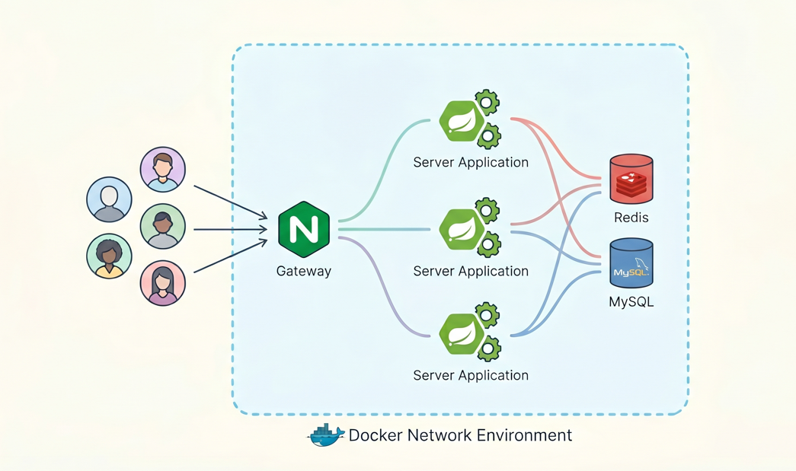

# 🎟️ DreamCatcher (티켓팅 서비스 PoC)

> **대규모 트래픽 환경에서의 동시성 제어 및 인프라 분산 처리 개념 증명(PoC) 프로젝트**

DreamCatcher는 콘서트 예매 오픈 시 발생하는 **10만 명 이상의 대규모 접속 트래픽**과 **좌석 선점 시 발생하는 극심한 동시성 문제**를 해결하기 위한 백엔드 코어 엔진입니다. 이 프로젝트는 단순한 CRUD를 넘어, 시스템 병목을 방어하고 데이터 무결성을 보장하는 **견고한 분산 아키텍처**를 구축하는 데 집중했습니다.

---

## 🎯 프로젝트 핵심 목표

1.  **서버 장애 방어:** 트래픽 폭주로 인한 RDBMS(MySQL) 커넥션 풀 고갈 및 서버 다운 방지
2.  **데이터 무결성(초과 예약 방지):** 다수의 유저가 동시에 동일한 좌석을 클릭할 때 발생하는 레이스 컨디션(Race Condition) 100% 차단
3.  **갱신 손실(Lost Update) 방지:** 동시 결제 시도 시 잔고가 이중으로 차감되는 마이너스 통장 현상 차단
4.  **분산 환경 정합성:** 다중 서버(Scale-out) 환경에서 스케줄러 중복 실행 방지 및 부하 분산

---

## 🛠️ 기술 스택 (Tech Stack)

*   **Backend:** Java 17, Spring Boot 3.x, Spring Data JPA
*   **Database:** MySQL 8.0, Redis (Lettuce)
*   **Concurrency Control:** Redisson (분산 락)
*   **Infrastructure:** Docker Compose, Nginx (Load Balancing)
*   **Testing:** JUnit5, K6 (Load Testing)

---

## 🚀 주요 구현 기능 및 아키텍처 (Core Features)



### 1. 대기열 시스템 (DB 병목 차단)
*   **문제:** 수만 명의 접속 요청이 일시에 DB로 몰려 커넥션이 고갈되고 서버가 마비되는 현상
*   **해결:** DB 접근 없이 인메모리 **Redis `ZSet`**을 활용해 사용자의 접속 시간을 점수(Score)로 삼아 대기표를 발급하고, 정해진 인원만 순차적으로 `ACTIVE` 상태로 통과시키는 1차 방어선 구축

### 2. 좌석 선점 동시성 제어 (초과 예약 방어)
*   **문제:** 대기열을 통과한 수백 명이 동시에 특정 좌석 예매를 시도할 때 다중 예약이 발생하는 현상
*   **해결:** **Redisson Pub/Sub 기반의 분산 락**을 적용하여 단 1명만 통과하도록 제어. 
*   **최적화 (퍼사드 패턴):** `@Transactional` 커밋 시점과 락 해제 시점의 불일치로 인한 동시성 틈새를 막기 위해, **퍼사드(Facade) 패턴**을 도입하여 트랜잭션이 완벽히 종료된 후 락이 해제되도록 실행 순서 강제 및 이중 검증 로직 구현

### 3. 낙관적 락을 통한 안전 결제 (따닥 방지)
*   **문제:** 유저의 실수나 다중 기기로 동시 결제 시 포인트 잔액이 이중 차감되는 갱신 손실 현상
*   **해결:** 다수와의 경쟁이 아닌 개인의 요청 충돌이므로, 무거운 분산 락 대신 **JPA 낙관적 락(`@Version`)**을 적용. 데이터 버전 충돌 시 후행 결제를 빠르고 안전하게 무효화(`OptimisticLockingFailureException`)

### 4. 분산 모놀리식 아키텍처 (Scale-out)
*   **문제:** 물리적인 단일 서버의 트래픽 처리 한계 및 단일 장애점(SPOF) 존재
*   **해결:** 동일한 Spring Boot 서버 3대를 Docker 컨테이너로 띄우고, 앞단에 **Nginx 리버스 프록시 및 로드밸런서(Round-Robin)**를 배치하여 트래픽을 균등하게 분배하는 고가용성 인프라 구축

### 5. 수동 TTL 스케줄러 & 만료 좌석 롤백
*   **문제:** 결제를 미루고 이탈한 '좀비 유저'로 인한 대기열 정체 및 '유령 좌석(영원히 예매 불가 상태)' 발생. Nginx 분산 환경으로 인한 스케줄러 3중 실행 문제.
*   **해결:** 
    *   Redis `ZSet`의 점수를 만료 타임스탬프(10분 뒤)로 설정하여 강제로 유저를 추방하는 **수동 TTL 청소부 스케줄러** 구현
    *   스케줄러에 **분산 락(`tryLock(waitTime=0)`)**을 걸어 3대의 서버 중 단 1대만 청소 작업을 수행하도록 제어
    *   추방 시 유저가 선점했던 `RESERVED` 상태의 좌석을 DB에서 찾아 다시 `AVAILABLE`로 되돌리는 **롤백(Rollback) 로직 연동**

---

## 📈 테스트 및 성능 검증 (Testing)

*   **통합 테스트 (JUnit):** `ExecutorService`와 `CountDownLatch`를 활용하여 100명 동시 좌석 선점 방어, 따닥 결제 방어 시나리오를 코드로 검증 완료
*   **부하 테스트 (K6):** 1만 명 유저 풀에서 1000명의 가상 유저(VU)가 동시에 진입하는 극강의 트래픽을 K6 자바스크립트로 시뮬레이션. 
    *   Nginx 로드밸런싱 및 분산 락/대기열 스케줄러의 실시간 방어 작동 확인 완료

---

## 🔮 향후 고도화 계획 (Next Steps)

현재 완성된 코어 엔진을 바탕으로, 실제 운영 가능한 대규모 서비스로 발전시키기 위한 로드맵입니다.

1.  **Observability (모니터링 강화):**
    *   Prometheus와 Grafana를 도입하여 분산 환경의 CPU, Memory, Nginx 트래픽, DB 커넥션 풀 상태를 실시간 시각화
2.  **MSA (마이크로서비스 아키텍처) 전환:**
    *   현재의 분산 모놀리식 구조를 `Queue`, `Seat`, `Payment` 도메인별 독립된 서비스로 분리 (Database per Service)
    *   API Gateway를 도입하여 JWT 기반 인증/인가를 앞단으로 분리하고 라우팅 일원화
3.  **EDA (이벤트 주도 아키텍처) 도입:**
    *   Kafka를 활용하여 좌석 선점 및 결제 이벤트를 비동기로 처리하여 결합도 감소 및 성능 최적화
    *   결제 실패 시 이벤트 기반의 분산 트랜잭션 보상 로직(Saga Pattern) 구현
4.  **실시간 UX 개선:**
    *   WebSockets 또는 SSE(Server-Sent Events)를 활용하여 대기열 순번 변동 및 취소표 발생 시 실시간 Push 알림 기능 도입

---

## ⚙️ 실행 방법 (How to Run)

1. 로컬 환경에 Docker 및 Docker Compose가 설치되어 있어야 합니다.
2. 터미널에서 프로젝트 루트 디렉토리로 이동 후 아래 명령어를 실행하여 분산 인프라를 한 번에 띄웁니다.
```bash
docker-compose up -d --build
```
3. K6 부하 테스트를 실행하려면 `k6` 디렉토리로 이동 후 스크립트를 실행합니다. (자세한 내용은 `k6/README.md` 참고)
```bash
cd k6
k6 run load-test.js
```
